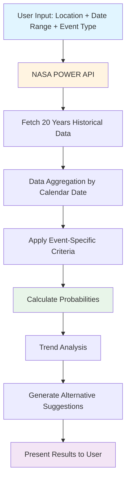

# Climate-Based Event Planning System: Methodology and Data Processing

## Project Overview

Our project leverages **NASA POWER (Prediction Of Worldwide Energy Resources)** historical climate data to predict optimal dates for outdoor events. By analyzing 20 years of historical weather patterns, we provide data-driven recommendations to help users plan events with confidence.

### Key Features

- 📊 **Historical Analysis**: 20 years of NASA climate data
- 🎯 **Event-Specific Criteria**: Customizable weather requirements
- 📈 **Trend Detection**: Recent vs. historical climate patterns
- 🗓️ **Smart Suggestions**: Alternative dates with better weather probability
- 🌍 **Global Coverage**: Works anywhere on Earth

---

## 1. Data Acquisition from NASA POWER API

### 1.1 Data Source

We utilize the **NASA POWER API** (https://power.larc.nasa.gov/), which provides meteorological and solar data derived from satellite observations and climate models. This dataset is freely available and covers the entire globe.

### 1.2 Retrieved Parameters

For each location and date range, we fetch the following daily climate variables:

| Parameter | Description | Unit | NASA Code |
|-----------|-------------|------|-----------|
| **Maximum Temperature** | Daily maximum temperature at 2m height | °C | `T2M_MAX` |
| **Minimum Temperature** | Daily minimum temperature at 2m height | °C | `T2M_MIN` |
| **Precipitation** | Total daily precipitation (bias-corrected) | mm/day | `PRECTOTCORR` |
| **Wind Speed** | Wind speed at 10m height | m/s | `WS10M` |
| **Relative Humidity** | Relative humidity at 2m height | % | `RH2M` |

### 1.3 Historical Range

```
Current Year: 2025
Historical Period: 2005 - 2024 (20 years)
Temporal Resolution: Daily
Spatial Resolution: 0.5° × 0.5° (≈ 50km at equator)
```

### 1.4 API Request Structure

For a given location (latitude, longitude) and date range, we make multiple API calls:

```
Base URL: https://power.larc.nasa.gov/api/temporal/daily/point

Parameters:
- latitude: User-selected location latitude
- longitude: User-selected location longitude
- start: YYYYMMDD (for each historical year)
- end: YYYYMMDD (for each historical year)
- community: 'ag' (Agricultural community)
- parameters: T2M_MAX,T2M_MIN,PRECTOTCORR,WS10M,RH2M
- format: json
```

**Example**: To analyze December 25th from 2005-2024:
- Request 1: Dec 25, 2005
- Request 2: Dec 25, 2006
- ...
- Request 20: Dec 25, 2024

This provides 20 historical samples for the same calendar date.

---

## 2. Data Processing Pipeline

### 2.1 Architecture Overview



### 2.2 Data Grouping Strategy

After fetching historical data, we group it by **calendar date (month + day)** regardless of year:

```javascript
// Grouping key: MMDD format
Example: December 25 → "1225"

dataByDay = {
  "1225": [
    {year: 2005, temp_max: 32.5, temp_min: 22.1, ...},
    {year: 2006, temp_max: 31.8, temp_min: 21.5, ...},
    ...
    {year: 2024, temp_max: 33.2, temp_min: 23.0, ...}
  ]
}
```

This allows us to analyze how weather conditions vary for the same calendar date across different years.

### 2.3 Data Expansion for Suggestions

To provide alternative date recommendations, we fetch data for an expanded range:

```
User Selection: Dec 20 - Dec 25
Expansion: ±30 days (configurable)
Total Range: Nov 20 - Jan 24

This provides ~65 days × 20 years = ~1,300 data points
```

---

## 3. Weather Analysis and Probability Calculation

### 3.1 Event Criteria Matching

Each event type has specific weather requirements. For example:

**Beach Event:**
```json
{
  "temp_min_ideal": 28,      // Minimum comfortable temperature
  "temp_max_ideal": 45,      // Maximum tolerable temperature
  "precipitation_max": 1,     // Maximum acceptable rain (mm)
  "wind_max": 20,            // Maximum wind speed (m/s)
  "humidity_max": 80         // Maximum humidity (%)
}
```

### 3.2 Year-by-Year Evaluation

For each historical year, we check if ALL criteria are met:

```javascript
// Pseudo-code for analysis
for each year in historical_data:
  ideal = true
  reasons = []

  if temp_min < criteria.temp_min_ideal:
    ideal = false
    reasons.push("too cold")

  if temp_max > criteria.temp_max_ideal:
    ideal = false
    reasons.push("too hot")

  if precipitation > criteria.precipitation_max:
    ideal = false
    reasons.push("too much rain")

  // ... check other criteria

  if ideal:
    idealYears++
```

### 3.3 Probability Metrics

We calculate two key probability metrics:

#### Overall Historical Probability
```
P_historical = (ideal_years / total_years) × 100

Example:
- Ideal years: 15 out of 20
- Probability: (15/20) × 100 = 75%
```

#### Recent Probability (Last 10 Years)
```
P_recent = (ideal_recent_years / recent_years) × 100

Example:
- Ideal recent years: 7 out of 10
- Recent probability: (7/10) × 100 = 70%
```

### 3.4 Trend Analysis

We detect climate trends by comparing recent vs. historical probabilities:

```javascript
difference = P_recent - P_historical
threshold = 10%

if difference > threshold:
  trend = "POSITIVE" (improving conditions)
else if difference < -threshold:
  trend = "NEGATIVE" (worsening conditions)
else:
  trend = "STABLE"
```

**Example Visualization:**

```
Historical Probability (2005-2024): ████████████████░░░░ 75%
Recent Probability (2015-2024):     ██████████████░░░░░░ 70%
Trend: ↓ NEGATIVE (-5%)
```

---

## 4. Visualization: Data Flow Example

### 4.1 Example: Beach Event on December 25

**Step 1: Raw Data Collection**

```
Date: December 25
Location: Rio de Janeiro (-22.9, -43.2)
Years analyzed: 2005-2024

Sample Data (3 years shown):
┌──────┬──────────┬──────────┬──────────────┬──────┬──────────┐
│ Year │ Temp Max │ Temp Min │ Precipitation│ Wind │ Humidity │
├──────┼──────────┼──────────┼──────────────┼──────┼──────────┤
│ 2022 │  32.5°C  │  24.2°C  │    0.0 mm    │ 12m/s│   68%    │
│ 2023 │  31.8°C  │  23.5°C  │    2.5 mm    │ 15m/s│   72%    │
│ 2024 │  35.1°C  │  26.8°C  │    0.1 mm    │  8m/s│   65%    │
└──────┴──────────┴──────────┴──────────────┴──────┴──────────┘
```

**Step 2: Criteria Evaluation**

```
Beach Event Criteria:
✓ temp_min >= 28°C
✓ temp_max <= 45°C
✓ precipitation <= 1 mm
✓ wind <= 20 m/s
✓ humidity <= 80%

Results:
2022: ✗ FAILED (temp_min: 24.2°C < 28°C)
2023: ✗ FAILED (precipitation: 2.5mm > 1mm)
2024: ✓ IDEAL (all criteria met)
```

**Step 3: Probability Calculation**

```
Total Years Analyzed: 20
Ideal Years: 12
Failed Years: 8

Overall Probability: 60%
Recent Probability (2015-2024): 50%
Trend: NEGATIVE (-10%)
```

### 4.2 Visual Representation of Historical Data

```
Temperature Range Over 20 Years (Dec 25)
°C
45│
40│              ●
35│        ●  ●  ●  ●  ●  ●
30│  ●  ●  ●  ●  ●  ●  ●  ●  ●  ●    ← Temp Max
25│  ●  ●  ●  ●  ●  ●  ●  ●  ●  ●    ← Temp Min
20│
  └──────────────────────────────────
   2005        2015        2024

Precipitation Pattern
mm
5│     ●                    ●
4│                 ●
3│        ●           ●
2│           ●           ●        ●
1│  ●           ●     ●     ●  ●
0│  ●  ●  ●  ●     ●     ●        ●
  └──────────────────────────────────
   2005        2015        2024
```

---

## 5. Alternative Date Suggestions

### 5.1 Ranking Algorithm

For each day in the expanded range, we calculate:

1. **Base Score**: Probability percentage (0-100)
2. **Recent Weight**: +10 if recent probability > historical
3. **Proximity Penalty**: -5 points per week distance from selected date

```javascript
score = probability + recent_bonus - proximity_penalty

Example:
Date: Dec 23 (2 days before selected Dec 25)
Probability: 80%
Recent trend: Positive (+10)
Proximity: 0 weeks (0 penalty)
Final Score: 90
```

### 5.2 Suggestion Output

Top 5 suggestions are presented:

```
🌟 BEST ALTERNATIVES:
1. Dec 23 - 90% probability (Historical: 85%, Recent: 90%) ↑
2. Dec 21 - 85% probability (Historical: 83%, Recent: 88%) ↑
3. Dec 27 - 78% probability (Historical: 80%, Recent: 75%) ↓
4. Dec 20 - 75% probability (Historical: 75%, Recent: 75%) →
5. Dec 28 - 72% probability (Historical: 70%, Recent: 75%) ↑
```

---

## 6. Technical Implementation

### 6.1 Service Architecture

```typescript
// Main Services:
├── NASADataFetcherService     // Data acquisition
│   └── fetchHistoricalData()  // Fetches 20 years of data
│
├── WeatherAnalysisService     // Analysis engine
│   ├── analyzeDay()           // Evaluates single day
│   ├── calculateTrend()       // Trend detection
│   └── findBestDay()          // Best alternative finder
│
└── ProbabilityFormatterService // UI formatting
    ├── getStyle()             // Color coding
    └── getMessage()           // User messages
```

### 6.2 Performance Optimization

**Parallel Fetching:**
```javascript
// Fetch all 20 years concurrently
const promises = years.map(year => fetchYearData(year))
await Promise.all(promises)

// Reduces total fetch time from ~20s to ~2s
```

**Progress Tracking:**
```javascript
onProgress: (completed, total) => {
  progress = (completed / total) × 100
  // Update UI: "Loading 15/20 years (75%)"
}
```

---

## 7. Data Quality and Limitations

### 7.1 NASA POWER Data Accuracy

- **Temperature**: ±2°C accuracy
- **Precipitation**: ±20% accuracy (bias-corrected)
- **Wind**: ±15% accuracy
- **Humidity**: ±10% accuracy

### 7.2 Known Limitations

1. **Spatial Resolution**: 50km grid - may not capture microclimate variations
2. **Historical Only**: Cannot predict future anomalies (e.g., climate change extremes)
3. **Data Availability**: Limited to 1981-present
4. **Missing Data**: Some regions/dates may have gaps (handled gracefully)

### 7.3 Reliability Indicators

We provide transparency through:
- Total years analyzed (e.g., "Based on 20 years of data")
- Trend indicators (positive/negative/stable)
- Individual year details (why each year failed/passed)

---

## 8. Example Use Cases

### Case 1: Wedding in São Paulo

```
Input:
- Location: São Paulo, Brazil (-23.5, -46.6)
- Date: September 15, 2025
- Event: Outdoor Wedding (custom criteria)

Output:
- Historical Probability: 78%
- Recent Probability: 85%
- Trend: Positive (+7%)
- Message: "GOOD probability of favorable weather!"
- Alternatives: Sep 12 (82%), Sep 13 (80%), Sep 10 (79%)
```

### Case 2: Beach Volleyball Tournament

```
Input:
- Location: Copacabana, Rio (-22.9, -43.2)
- Date Range: Dec 20-25, 2025
- Event: Beach Volleyball

Output:
Best Day: Dec 23 (85% probability)
Worst Day: Dec 25 (60% probability)
Recommendation: "Consider moving event to Dec 23 for +25% better conditions"
```

---

## 9. Future Enhancements

### 9.1 Planned Features

- [ ] Machine learning for trend prediction
- [ ] Extreme event detection (heatwaves, storms)
- [ ] Multi-location comparison
- [ ] Export to calendar with weather alerts
- [ ] Integration with real-time forecast APIs

### 9.2 Data Expansion

- [ ] Add more NASA parameters (UV index, cloud cover)
- [ ] Incorporate ERA5 reanalysis data for higher resolution
- [ ] Historical event correlation (e.g., El Niño years)

---

## 10. Conclusion

Our climate-based event planning system transforms 20 years of NASA satellite data into actionable insights for event organizers. By combining:

1. **Robust Data Sources** (NASA POWER API)
2. **Statistical Analysis** (probability calculation, trend detection)
3. **User-Centric Design** (customizable criteria, smart suggestions)

We empower users to make informed decisions about event timing, reducing weather-related risks and improving overall planning confidence.

**Key Achievement**: Converting raw climate data into a 0-100% probability score that anyone can understand and act upon.

---

## References

- NASA POWER API Documentation: https://power.larc.nasa.gov/docs/
- POWER Data Methodology: https://power.larc.nasa.gov/docs/methodology/
- Climate Data Repository: https://github.com/nasa/POWER-API

---

*Generated for NASA Space Apps Challenge 2025*
*Project Team: [Your Team Name]*
*Challenge: [Challenge Name]*
