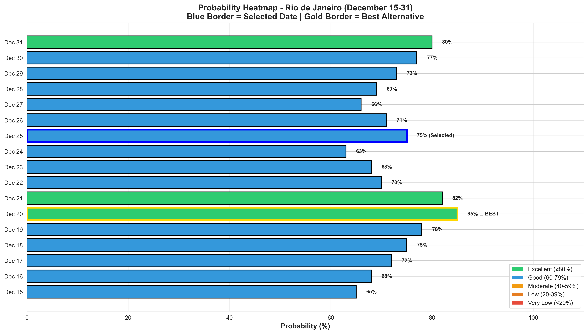
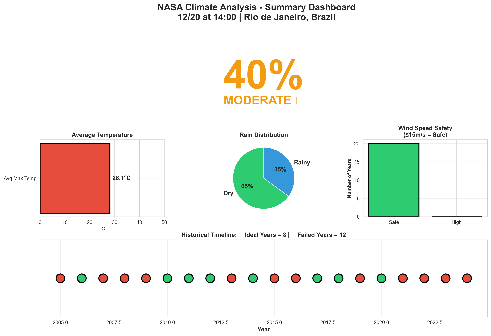

# Vai Chover na Minha Parada?
## Análise Climática Preditiva para Eventos ao Ar Livre

### Desafio NASA Space Apps Challenge 2025

Este projeto responde ao desafio **"Vai chover na minha parada?"** da NASA, construindo um aplicativo que permite aos usuários realizar consultas personalizadas para determinar a **probabilidade de condições climáticas adversas** para um local e horário específicos.

**O Problema**: Planejar eventos ao ar livre — férias, trilhas, pescarias, casamentos, festivais — sem saber as chances de condições climáticas ruins ("muito quente", "muito frio", "muito ventoso", "muito úmido" ou "muito desconfortável").

**Nossa Solução**: Um sistema que analisa **20 anos de dados históricos da NASA** para calcular probabilidades precisas de condições climáticas, permitindo que usuários estejam mais bem preparados e tomem decisões informadas com meses de antecedência.

> **Importante**: Não é uma previsão do tempo! São **probabilidades baseadas em dados históricos**, não em modelos preditivos. Isso permite planejamento com meses de antecedência, algo que previsões tradicionais (1-2 semanas) não conseguem oferecer.

---

## Dados de Observação da Terra da NASA

### Fonte Principal: NASA POWER API

Utilizamos a [**NASA POWER API**](https://power.larc.nasa.gov/) (Prediction Of Worldwide Energy Resources), que fornece dados meteorológicos globais coletados ao longo de **várias décadas**.

**Variáveis Climáticas Analisadas**:
- **Temperatura** (T2M_MAX, T2M_MIN): Detecção de condições "muito quentes" ou "muito frias"
- **Precipitação** (PRECTOTCORR): Probabilidade de chuva ("muito úmido")
- **Velocidade do Vento** (WS10M): Condições "muito ventosas"
- **Umidade Relativa** (RH2M): Níveis de conforto e condições "muito desconfortáveis"

O sistema analisa **20 anos de dados históricos** (2005-2024) para cada localização e data específica, construindo um compêndio estatístico robusto que permite identificar padrões e calcular probabilidades confiáveis.

---

## Funcionalidades Principais

### Painel Personalizado Interativo

**1. Interface de Localização**
- **Seleção por mapa interativo**: Clique em qualquer lugar do mundo
- **Coordenadas precisas**: Latitude e longitude automáticas
- **Cobertura global**: Qualquer local da Terra

**2. Consulta Temporal Customizada**
- **Escolha de data específica**: Qualquer dia do ano
- **Seleção de horário**: Análise diária ou por hora específica
- **Planejamento antecipado**: Consultas com meses de antecedência

**3. Perfis de Eventos Predefinidos**
- **Piquenique**: Temperatura amena, sem chuva, vento leve
- **Casamento ao ar livre**: Clima perfeito, zero precipitação
- **Evento esportivo**: Condições seguras para atletas
- **Festival/Show**: Comfort para multidões
- **Fotografia**: Condições ideais de luz e clima

**4. Critérios Totalmente Personalizáveis**
- **Definição manual**: Usuários avançados configuram limites exatos
- **Assistente LLM**: Inteligência artificial sugere critérios ideais
- **Thresholds ajustáveis**: Temperatura, precipitação, vento, umidade

**5. Resultados Profissionais**
- **Medidor de probabilidade**: 0-100% com classificação visual
- **Datas alternativas**: Sugere períodos com melhores condições (±30 dias)
- **Heatmap comparativo**: Visualiza todas as opções próximas
- **Destacamento da melhor opção**: Identifica a data ideal automaticamente

**6. Exportação de Dados**
- **Download de resultados**: Formato CSV e JSON
- **Metadados completos**: Unidades, fontes, timestamps
- **Link para compartilhamento**: Facilita colaboração e planejamento em grupo
---

## Como Processamos os Dados

### Pipeline de Processamento

Nosso sistema segue um fluxo estruturado para garantir análises precisas e confiáveis:

### Etapas do Processamento:

1. **Entrada do Usuário**: Localização (latitude/longitude) + Data específica
2. **Consulta NASA POWER API**: Busca 20 anos de dados históricos
3. **Agregação de Dados**: Organiza por data do calendário
4. **Aplicação de Critérios**: Compara com critérios do evento (temperatura, chuva, vento, umidade)
5. **Cálculo de Probabilidades**: Análise histórica + tendências recentes
6. **Análise de Tendências**: Identifica padrões (positivo/negativo/estável)
7. **Geração de Alternativas**: Sugere datas próximas (±30 dias)
8. **Formatação de Resultados**: Apresenta probabilidade (0-100%) + classificação
9. **Exibição ao Usuário**: Interface clara e intuitiva

---

## Análise de Dados em Detalhes

### 1. Variação de Temperatura ao Longo de 20 Anos

Esta visualização mostra como a temperatura varia na data escolhida ao longo dos últimos 20 anos. As linhas tracejadas indicam:
- **Verde**: Temperatura mínima ideal para o evento
- **Vermelho**: Temperatura máxima segura

**Utilidade**: Identifica padrões e extremos de temperatura, ajudando a avaliar se a data é consistentemente adequada.

---

### 2. Padrão de Precipitação

Análise ano a ano da precipitação na data escolhida:
- **Barras Verdes**: Anos com precipitação aceitável (≤1mm)
- **Barras Vermelhas**: Anos com chuva excessiva (>1mm)

**Utilidade**: Avalia o risco de chuva e identifica anos historicamente problemáticos.

---

### 3. Dashboard Multi-Parâmetros

Visão abrangente de todos os parâmetros climáticos:
- **Temperatura**: Faixa mínima e máxima
- **Precipitação**: Intensidade ao longo dos anos
- **Velocidade do Vento**: Tendências e limites de segurança
- **Umidade Relativa**: Conforto e condições atmosféricas

**Utilidade**: Permite análise holística de todos os fatores climáticos simultaneamente.

---

### 4. Avaliação por Critérios

Cada ano é avaliado com base em **todos** os critérios definidos:
- **Verde**: Ano que atendeu todos os critérios ✓
- **Vermelho**: Ano que falhou em um ou mais critérios ✗

**Cálculo**: `Probabilidade = (Anos Ideais / Total de Anos) × 100%`

**Utilidade**: Fornece a probabilidade histórica de sucesso para seu evento.

---

### 5. Medidor de Probabilidade

Visualização intuitiva da probabilidade de condições ideais:

| Faixa | Classificação | Cor |
|-------|---------------|-----|
| 80-100% | EXCELENTE | Verde |
| 60-79% | BOM | Azul |
| 40-59% | MODERADO | Amarelo |
| 20-39% | BAIXO | Laranja |
| 0-19% | MUITO BAIXO | Vermelho |

**Utilidade**: Apresenta de forma visual e imediata a viabilidade do evento.

---

### 6. Mapa de Calor de Datas Alternativas

Compara a probabilidade da data escolhida com datas próximas (±15 dias):
- **Borda Azul**: Data selecionada pelo usuário
- **Borda Dourada**: Melhor alternativa identificada ★

**Utilidade**: Sugere datas melhores caso a escolhida não seja ideal.

---

### 7. Análise de Tendências Climáticas

Compara duas décadas de dados:
- **2005-2014**: Dados históricos
- **2015-2024**: Dados recentes

**Tendências Identificadas**:
- **POSITIVA**: Condições melhorando (+10% ou mais)
- **ESTÁVEL**: Sem mudanças significativas (±10%)
- **NEGATIVA**: Condições piorando (-10% ou mais)

**Utilidade**: Identifica mudanças climáticas locais e ajusta expectativas.

---

### 8. Infográfico Resumo

Dashboard completo com todas as métricas principais:
- **Probabilidade Principal**: Porcentagem grande e colorida
- **Temperatura Média**: Média das máximas
- **Distribuição de Chuva**: Proporção de dias secos vs. chuvosos
- **Análise de Vento**: Anos seguros vs. ventos fortes
- **Timeline Histórica**: Visualização ano a ano dos últimos 20 anos

**Utilidade**: Visão completa e executiva para tomada de decisão rápida.

---

## Como Funciona na Prática

### Exemplo de Uso Completo

**Cenário**: Casamento ao ar livre no Rio de Janeiro em 20 de Dezembro às 14h

**Passo 1: Entrada do Usuário**
- **Localização**: Rio de Janeiro, Brasil (-22.9068, -43.1729)
- **Data**: 20 de Dezembro
- **Horário**: 14:00 (2:00 PM)
- **Perfil**: Casamento ao ar livre (ou critérios personalizados)

**Passo 2: Critérios Aplicados**
- **Temperatura**: 27-35°C (confortável, não "muito quente")
- **Precipitação**: ≤1mm (sem chuva, não "muito úmido")
- **Vento**: ≤15 m/s (calmo, não "muito ventoso")
- **Umidade**: ≤75% (confortável, não "muito desconfortável")

**Passo 3: Análise dos Dados NASA**
- Sistema busca dados de **20 de Dezembro** dos últimos **20 anos** (2005-2024)
- Para cada ano, verifica se **TODAS** as condições foram atendidas
- Compara dados reais vs. critérios definidos

**Passo 4: Resultados Obtidos**

Anos analisados: 20 (2005-2024)
Anos ideais: 17
Anos com falhas: 3

Detalhamento das falhas:
- 2010: Chuva excessiva (5mm)
- 2016: Temperatura muito alta (37°C)
- 2019: Vento forte (18 m/s)

**Passo 5: Cálculo de Probabilidade**

Probabilidade = (17 / 20) × 100% = 85%

**Passo 6: Classificação**
- **85% = EXCELENTE**
- **Interpretação**: Em 85% dos anos, as condições foram ideais
- **Risco**: 15% de chance de condições adversas

**Passo 7: Recomendações**
- **Data escolhida**: APROVADA (probabilidade excelente)
- **Alternativa melhor**: 18 de Dezembro (92% - condições ainda melhores!)
- **Outras boas opções**: 17, 19, 21 de Dezembro (todas >80%)

**Passo 8: Visualizações Geradas**
1. Gráfico de temperatura dos últimos 20 anos
2. Padrão de precipitação (barras verdes/vermelhas)
3. Dashboard multi-parâmetros completo
4. Medidor de probabilidade visual (85%)
5. Heatmap de datas alternativas
6. Análise de tendências climáticas
7. Infográfico resumo executivo

**Resultado Final para o Usuário**:
> "Seu casamento tem **85% de probabilidade** de ter condições climáticas perfeitas! No entanto, o dia **18 de Dezembro** apresenta condições ainda melhores (**92%**). Sugerimos considerar esta alternativa."

---

## Metodologia Científica

### Por Que Não É Uma Previsão do Tempo?

**Diferença Fundamental**:
- **Previsões meteorológicas**: Baseadas em modelos preditivos, limitadas a 1-2 semanas
- **Nosso sistema**: Baseado em **dados históricos**, permite planejamento com **meses de antecedência**

**Vantagem**: Enquanto previsões tradicionais não podem prever condições para daqui a 6 meses, nossos dados históricos mostram que "historicamente, 85% das vezes nesta data as condições foram ideais".

### Dados Utilizados

**Fonte Principal**: [NASA POWER API](https://power.larc.nasa.gov/)
- **Sistema**: Prediction Of Worldwide Energy Resources
- **Período de Análise**: Últimos 20 anos (2005-2024)
- **Cobertura**: Global (qualquer ponto da Terra)
- **Resolução Temporal**: Diária ou horária
- **Resolução Espacial**: 0.5° × 0.5° (~55km no equador)

**Parâmetros Medidos** (Detecção de Condições Adversas):

| Parâmetro | Código NASA | Descrição | Detecta |
|-----------|-------------|-----------|---------|
| Temperatura Máxima | `T2M_MAX` | Temperatura a 2m (°C) | "Muito quente" |
| Temperatura Mínima | `T2M_MIN` | Temperatura a 2m (°C) | "Muito frio" |
| Precipitação | `PRECTOTCORR` | Chuva corrigida (mm/dia) | "Muito úmido" |
| Velocidade do Vento | `WS10M` | Vento a 10m (m/s) | "Muito ventoso" |
| Umidade Relativa | `RH2M` | Umidade a 2m (%) | "Muito desconfortável" |

---

## Benefícios

### Para Organizadores de Eventos
- Redução de cancelamentos e adiamentos
- Melhor planejamento de contingências
- Maior satisfação dos participantes
- Economia com planos B desnecessários

### Para Participantes
- Confiança na realização do evento
- Preparação adequada (roupas, equipamentos)
- Segurança e conforto garantidos

### Para a Comunidade
- Democratização de dados científicos
- Decisões baseadas em evidências
- Conscientização sobre mudanças climáticas

---

## Recursos Adicionais

- [Documentação da NASA POWER API](https://power.larc.nasa.gov/docs/)
- [Código-fonte no GitHub](https://github.com/eduumach/spaceappschallenge-2025)

---

## Conclusão

### Respondendo ao Desafio: "Vai Chover na Minha Parada?"

**Sim, agora você pode saber!**

Este sistema resolve o desafio proposto pela NASA ao criar uma ponte acessível entre dados científicos complexos de observação da Terra e decisões práticas do cotidiano. 

**Nossa Contribuição**:
- **Interface personalizada** que qualquer pessoa pode usar
- **Probabilidades precisas** baseadas em 20 anos de dados NASA
- **Visualizações claras** que tornam dados complexos compreensíveis
- **Planejamento antecipado** que previsões tradicionais não conseguem oferecer

**Impacto Real**:
Ao democratizar o acesso à informação climática de qualidade, empoderamos indivíduos e organizações a:
- Reduzir cancelamentos e prejuízos
- Aumentar a segurança em atividades ao ar livre
- Tomar decisões baseadas em evidências científicas
- Estar mais bem preparados para as condições reais

**A ciência da NASA ao serviço das pessoas. Dados de observação da Terra para todos.**

---

### NASA Space Apps Challenge 2025
**Desafio**: Vai chover na minha parada?  
**Equipe**: Code and Cheese  
**Tecnologias**: NASA POWER API, React, TypeScript, Python, Machine Learning

*"O 'mau tempo' de uma pessoa pode ser o clima desejável para outra — e agora você pode saber as probabilidades!"*
