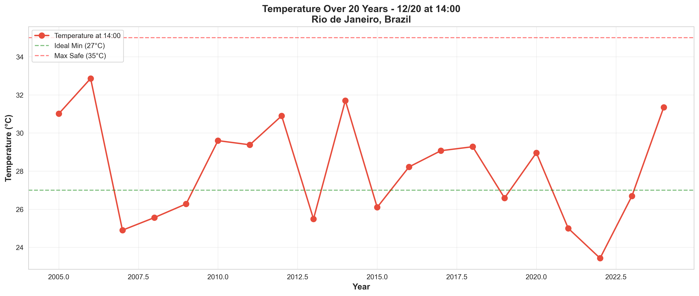
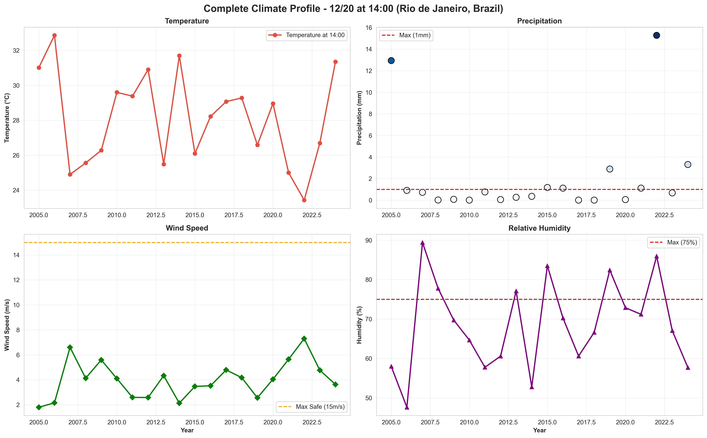
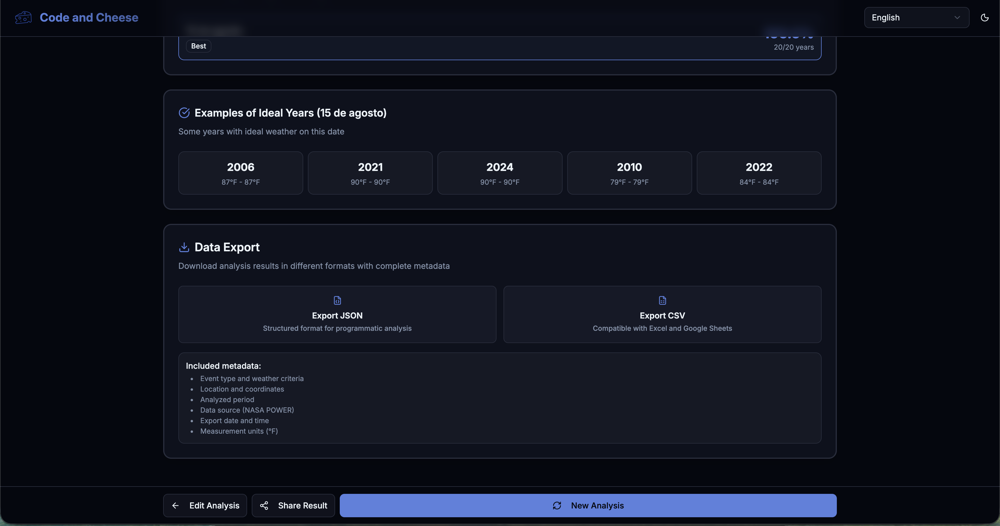

# Vai Chover na Minha Parada?
## Análise Climática Preditiva para Eventos ao Ar Livre

### Desafio NASA Space Apps Challenge 2025

Este projeto responde ao desafio **"Vai chover na minha parada?"** da NASA, construindo um aplicativo que permite aos usuários realizar consultas personalizadas para determinar a **probabilidade de condições climáticas adversas** para um local e horário específicos.

**O Problema**: Planejar eventos ao ar livre — férias, trilhas, pescarias, casamentos, festivais — sem saber as chances de condições climáticas ruins ("muito quente", "muito frio", "muito ventoso", "muito úmido" ou "muito desconfortável").

**Nossa Solução**: Um sistema que analisa **20 anos de dados históricos da NASA** para calcular probabilidades precisas de condições climáticas, permitindo que usuários estejam mais bem preparados e tomem decisões informadas com meses de antecedência.

> **Importante**: Não é uma previsão do tempo! São **probabilidades baseadas em dados históricos**, não em modelos preditivos. Isso permite planejamento com meses de antecedência, algo que previsões tradicionais (1-2 semanas) não conseguem oferecer.

---

## Dados de Observação da Terra da NASA

### Fonte Principal: NASA POWER API

Utilizamos a [**NASA POWER API**](https://power.larc.nasa.gov/) (Prediction Of Worldwide Energy Resources), que fornece dados meteorológicos globais de temperatura, precipitação, vento e umidade coletados ao longo de **várias décadas**.

O sistema analisa **20 anos de dados históricos** (2005-2024) para cada localização e data específica, construindo um compêndio estatístico robusto que permite identificar padrões e calcular probabilidades confiáveis.

---

## Funcionalidades Principais

- **Seleção de Localização**: Mapa interativo com cobertura global e coordenadas precisas
- **Consulta Personalizada**: Escolha de data e horário com planejamento antecipado (meses de antecedência)
- **Perfis de Eventos**: Templates predefinidos (piquenique, casamento, esportes, festival, fotografia) ou critérios customizados via assistente LLM
- **Análise de Probabilidade**: Medidor visual 0-100% baseado em dados históricos NASA
- **Datas Alternativas**: Heatmap comparativo (±30 dias) destacando a melhor opção
- **Exportação Completa**: Download em CSV/JSON com metadados e compartilhamento
---

## Como Processamos os Dados

### Pipeline de Processamento

Nosso sistema segue um fluxo estruturado para garantir análises precisas e confiáveis:

### Etapas do Processamento:

1. **Entrada do Usuário**: Localização (latitude/longitude) + Data específica
2. **Consulta NASA POWER API**: Busca dados históricos (2005-2024)
3. **Agregação de Dados**: Organiza por data do calendário
4. **Aplicação de Critérios**: Compara com critérios do evento (temperatura, chuva, vento, umidade)
5. **Cálculo de Probabilidades**: Análise histórica + tendências recentes
6. **Análise de Tendências**: Identifica padrões (positivo/negativo/estável)
7. **Geração de Alternativas**: Sugere datas próximas (±30 dias)
8. **Formatação de Resultados**: Apresenta probabilidade (0-100%) + classificação
9. **Exibição ao Usuário**: Interface clara e intuitiva

---

## Análise de Dados em Detalhes

### 1. Variação de Temperatura ao Longo de 20 Anos

Esta visualização mostra como a temperatura varia na data escolhida ao longo dos últimos 20 anos. As linhas tracejadas indicam:
- **Verde**: Temperatura mínima ideal para o evento
- **Vermelho**: Temperatura máxima segura

**Utilidade**: Identifica padrões e extremos de temperatura, ajudando a avaliar se a data é consistentemente adequada.

---

### 2. Padrão de Precipitação

Análise ano a ano da precipitação na data escolhida:
- **Barras Verdes**: Anos com precipitação aceitável (≤1mm)
- **Barras Vermelhas**: Anos com chuva excessiva (>1mm)

**Insights**: Avalia o risco de chuva e identifica anos historicamente problemáticos.

---

### 3. Dashboard Multi-Parâmetros

Visão abrangente de todos os parâmetros climáticos:
- **Temperatura**: Faixa mínima e máxima
- **Precipitação**: Intensidade ao longo dos anos
- **Velocidade do Vento**: Tendências e limites de segurança
- **Umidade Relativa**: Conforto e condições atmosféricas

**Vantagem**: Permite análise holística de todos os fatores climáticos simultaneamente.

---

### 4. Avaliação por Critérios

Cada ano é avaliado com base em **todos** os critérios definidos:
- **Verde**: Ano que atendeu todos os critérios ✓
- **Vermelho**: Ano que falhou em um ou mais critérios ✗

**Cálculo**: `Probabilidade = (Anos Ideais / Total de Anos) × 100%`

**Aplicação**: Fornece a probabilidade histórica de sucesso para seu evento.

---

### 5. Mapa de Calor de Datas Alternativas

Compara a probabilidade da data escolhida com datas próximas (±15 dias):
- **Borda Azul**: Data selecionada pelo usuário
- **Borda Dourada**: Melhor alternativa identificada ★

**Benefício**: Sugere datas melhores caso a escolhida não seja ideal.

---

### 6. Análise de Tendências Climáticas

Compara duas décadas de dados:
- **2005-2014**: Dados históricos
- **2015-2024**: Dados recentes

**Tendências Identificadas**:
- **POSITIVA**: Condições melhorando (+10% ou mais)
- **ESTÁVEL**: Sem mudanças significativas (±10%)
- **NEGATIVA**: Condições piorando (-10% ou mais)

**Insights**: Identifica mudanças climáticas locais e ajusta expectativas.

---

### 7. Infográfico Resumo

Dashboard completo com todas as métricas principais:
- **Probabilidade Principal**: Porcentagem grande e colorida
- **Temperatura Média**: Média das máximas
- **Distribuição de Chuva**: Proporção de dias secos vs. chuvosos
- **Análise de Vento**: Anos seguros vs. ventos fortes
- **Timeline Histórica**: Visualização ano a ano (2005-2024)

**Utilidade**: Visão completa e executiva para tomada de decisão rápida.

---

## Como Funciona na Prática

**Cenário**: Planejamento de um churrasco em Uberlândia no dia 15 de agosto de 2026 às 14:00

### **Selecione a localização no mapa**

Clique em Uberlândia ou insira as coordenadas manualmente

### **Escolha a data e horário do evento**

Defina 15 de agosto de 2026 às 14:00

### **Selecione o perfil de evento**
Escolha "Churrasco" ou personalize os critérios climáticos

### **Visualize os resultados da análise**
Confira a probabilidade e os dados históricos detalhados

### **Analise as tendências climáticas**
Compare dados das últimas duas décadas

### **Explore datas alternativas**
Neste exemplo, 15 de agosto apresentou 100% de probabilidade ideal. Para demonstrar a funcionalidade de alternativas, testamos também 24 de outubro de 2025 (35% de probabilidade), que mostra sugestões de datas próximas com melhores condições.

### **Exporte os dados para análise**
Baixe os resultados em CSV ou JSON

---

## Metodologia Científica

### Dados Utilizados

**Fonte Principal**: [NASA POWER API](https://power.larc.nasa.gov/)
- **Sistema**: Prediction Of Worldwide Energy Resources
- **Período de Análise**: 2005-2024 (duas décadas)
- **Cobertura**: Global (qualquer ponto da Terra)
- **Resolução Temporal**: Diária ou horária
- **Resolução Espacial**: 0.5° × 0.5° (~55km no equador)

**Parâmetros Medidos** (Detecção de Condições Adversas):

- **`T2M_MAX` / `T2M_MIN`** — Temperatura a 2m (°C)
  Detecta: condições **"muito quentes"** ou **"muito frias"**

- **`PRECTOTCORR`** — Precipitação corrigida (mm/dia)
  Detecta: condições **"muito úmidas"** (chuva)

- **`WS10M`** — Velocidade do vento a 10m (m/s)
  Detecta: condições **"muito ventosas"**

- **`RH2M`** — Umidade relativa a 2m (%)
  Detecta: condições **"muito desconfortáveis"**

---

## Benefícios e Impacto

### Para Organizadores de Eventos
- Redução de cancelamentos, adiamentos e prejuízos
- Melhor planejamento de contingências
- Maior satisfação e segurança dos participantes

### Para Participantes
- Confiança na realização do evento
- Preparação adequada (roupas, equipamentos)
- Maior conforto e segurança em atividades ao ar livre

### Para a Comunidade
- Democratização do acesso a dados científicos de qualidade
- Decisões baseadas em evidências
- Conscientização sobre mudanças climáticas locais

---

## Recursos Adicionais

- [Documentação da NASA POWER API](https://power.larc.nasa.gov/docs/)
- [Código-fonte no GitHub](https://github.com/eduumach/spaceappschallenge-2025)

---

## Conclusão

### Respondendo ao Desafio: "Vai Chover na Minha Parada?"

**Sim, agora você pode saber!**

Este sistema resolve o desafio proposto pela NASA ao criar uma ponte acessível entre dados científicos complexos de observação da Terra e decisões práticas do cotidiano. 

**Nossa Contribuição**:
- **Interface personalizada** que qualquer pessoa pode usar
- **Probabilidades precisas** baseadas em dados históricos NASA (2005-2024)
- **Visualizações claras** que tornam dados complexos compreensíveis
- **Planejamento antecipado** que previsões tradicionais não conseguem oferecer

**A ciência da NASA ao serviço das pessoas. Dados de observação da Terra para todos.**

---

### NASA Space Apps Challenge 2025
**Desafio**: Vai chover na minha parada?  
**Equipe**: Code and Cheese  
**Tecnologias**: NASA POWER API, React, TypeScript, Python, Machine Learning

*"O 'mau tempo' de uma pessoa pode ser o clima desejável para outra — e agora você pode saber as probabilidades!"*
