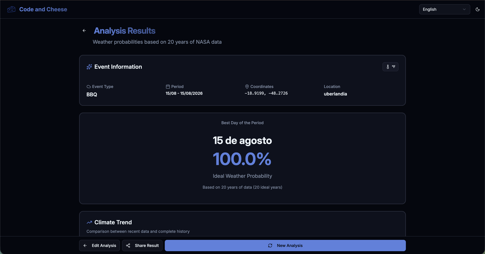

# Will It Rain on My Parade?
## Predictive Climate Analysis for Outdoor Events

### NASA Space Apps Challenge 2025

This project addresses NASA's **"Will it rain on my parade?"** challenge by building an application that allows users to make personalized queries to determine the **probability of adverse weather conditions** for a specific location and time.

**The Problem**: Planning outdoor events — vacations, hikes, fishing trips, weddings, festivals — without knowing the chances of bad weather conditions ("too hot", "too cold", "too windy", "too wet" or "too uncomfortable").

**Our Solution**: A system that analyzes **20 years of NASA historical data** to calculate accurate weather condition probabilities, allowing users to be better prepared and make informed decisions months in advance.

> **Important**: This is not a weather forecast! These are **probabilities based on historical data**, not predictive models. This allows planning months in advance, something traditional forecasts (1-2 weeks) cannot offer.

---

## NASA Earth Observation Data

### Primary Source: NASA POWER API

We use the [**NASA POWER API**](https://power.larc.nasa.gov/) (Prediction Of Worldwide Energy Resources), which provides global meteorological data on temperature, precipitation, wind, and humidity collected over **several decades**.

The system analyzes **20 years of historical data** (2005-2024) for each specific location and date, building a robust statistical compendium that enables pattern identification and reliable probability calculations.

---

## Key Features

- **Location Selection**: Interactive map with global coverage and precise coordinates
- **Personalized Query**: Date and time selection with advance planning (months ahead)
- **Event Profiles**: Predefined templates (picnic, wedding, sports, festival, photography) or custom criteria via LLM assistant
- **Probability Analysis**: Visual gauge 0-100% based on NASA historical data
- **Alternative Dates**: Comparative heatmap (±30 days) highlighting the best option
- **Complete Export**: CSV/JSON download with metadata and sharing
---

## How We Process the Data

### Processing Pipeline

Our system follows a structured workflow to ensure accurate and reliable analyses:

### Processing Steps:

1. **User Input**: Location (latitude/longitude) + Specific date
2. **NASA POWER API Query**: Fetch historical data (2005-2024)
3. **Data Aggregation**: Organize by calendar date
4. **Criteria Application**: Compare with event criteria (temperature, rain, wind, humidity)
5. **Probability Calculation**: Historical analysis + recent trends
6. **Trend Analysis**: Identify patterns (positive/negative/stable)
7. **Alternative Generation**: Suggest nearby dates (±30 days)
8. **Results Formatting**: Present probability (0-100%) + classification
9. **User Display**: Clear and intuitive interface

---

## Data Analysis in Detail

### 1. Temperature Variation Over 20 Years

This visualization shows how temperature varies on the chosen date over the last 20 years. The dashed lines indicate:
- **Green**: Ideal minimum temperature for the event
- **Red**: Safe maximum temperature

**Usefulness**: Identifies temperature patterns and extremes, helping assess if the date is consistently suitable.

---

### 2. Precipitation Pattern

Year-by-year analysis of precipitation on the chosen date:
- **Green Bars**: Years with acceptable precipitation (≤1mm)
- **Red Bars**: Years with excessive rain (>1mm)

**Insights**: Assesses rain risk and identifies historically problematic years.

---

### 3. Multi-Parameter Dashboard

Comprehensive view of all climate parameters:
- **Temperature**: Minimum and maximum range
- **Precipitation**: Intensity over the years
- **Wind Speed**: Trends and safety limits
- **Relative Humidity**: Comfort and atmospheric conditions

**Advantage**: Enables holistic analysis of all climate factors simultaneously.

---

### 4. Criteria Evaluation

Each year is evaluated based on **all** defined criteria:
- **Green**: Year that met all criteria ✓
- **Red**: Year that failed one or more criteria ✗

**Calculation**: `Probability = (Ideal Years / Total Years) × 100%`

**Application**: Provides the historical probability of success for your event.

---

### 5. Alternative Dates Heat Map

Compares the chosen date's probability with nearby dates (±15 days):
- **Blue Border**: User-selected date
- **Golden Border**: Best alternative identified

**Benefit**: Suggests better dates if the chosen one is not ideal.

---

### 6. Summary Infographic

Complete dashboard with all key metrics:
- **Main Probability**: Large, color-coded percentage
- **Average Temperature**: Mean of maximum temperatures
- **Rain Distribution**: Proportion of dry vs. rainy days
- **Wind Analysis**: Safe years vs. strong winds
- **Historical Timeline**: Year-by-year visualization (2005-2024)

**Usefulness**: Complete executive view for quick decision-making.

---

## How It Works in Practice

**Scenario**: Planning a barbecue in Uberlândia on August 15, 2026, at 2:00 PM

### **Select the location on the map**

Click on Uberlândia or enter coordinates manually

### **Choose the event date and time**

Set August 15, 2026, at 2:00 PM

### **Select the event profile**
Choose "Barbecue" or customize weather criteria

### **View analysis results**
Check the probability and detailed historical data

### **Analyze climate trends**
Compare data from the last two decades

### **Explore alternative dates**
In this example, August 15 showed 100% ideal probability. To demonstrate the alternative feature, we also tested October 24, 2025 (35% probability), which shows suggested nearby dates with better conditions.

### **Export data for analysis**
Download results in CSV or JSON

---

## Scientific Methodology

### Data Used

**Primary Source**: [NASA POWER API](https://power.larc.nasa.gov/)
- **System**: Prediction Of Worldwide Energy Resources
- **Analysis Period**: 2005-2024 (two decades)
- **Coverage**: Global (any point on Earth)
- **Temporal Resolution**: Daily or hourly
- **Spatial Resolution**: 0.5° × 0.5° (~55km at equator)

**Measured Parameters** (Adverse Condition Detection):

- **`T2M_MAX` / `T2M_MIN`** — Temperature at 2m (°C)
  Detects: **"too hot"** or **"too cold"** conditions

- **`PRECTOTCORR`** — Corrected precipitation (mm/day)
  Detects: **"too wet"** conditions (rain)

- **`WS10M`** — Wind speed at 10m (m/s)
  Detects: **"too windy"** conditions

- **`RH2M`** — Relative humidity at 2m (%)
  Detects: **"too uncomfortable"** conditions

---

## Benefits and Impact

### For Event Organizers
- Reduction of cancellations, postponements, and losses
- Better contingency planning
- Greater participant satisfaction and safety

### For Participants
- Confidence in event execution
- Adequate preparation (clothing, equipment)
- Greater comfort and safety in outdoor activities

### For the Community
- Democratization of access to quality scientific data
- Evidence-based decisions
- Awareness of local climate change

---

## Additional Resources

- [NASA POWER API Documentation](https://power.larc.nasa.gov/docs/)
- [Source Code on GitHub](https://github.com/eduumach/spaceappschallenge-2025)

---

## Conclusion

### Answering the Challenge: "Will It Rain on My Parade?"

**Yes, now you can know!**

This system addresses NASA's challenge by creating an accessible bridge between complex Earth observation scientific data and practical everyday decisions.

**Our Contribution**:
- **Personalized interface** that anyone can use
- **Accurate probabilities** based on NASA historical data (2005-2024)
- **Clear visualizations** that make complex data understandable
- **Advance planning** that traditional forecasts cannot offer

**NASA science serving people. Earth observation data for everyone.**

---

### NASA Space Apps Challenge 2025
**Challenge**: Will it rain on my parade?
**Team**: Code and Cheese
**Technologies**: NASA POWER API, React, TypeScript, Python, Machine Learning
